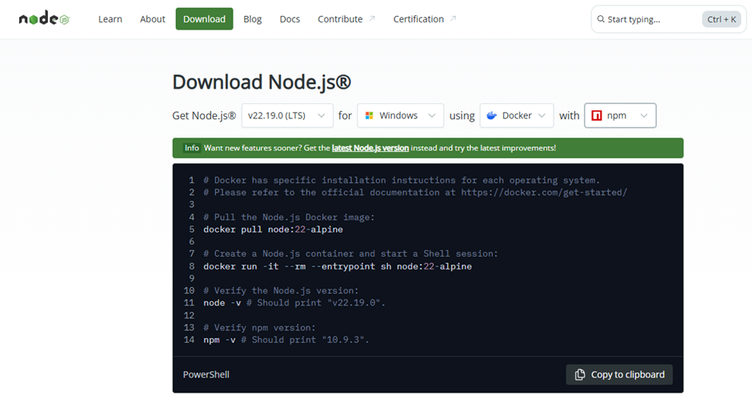
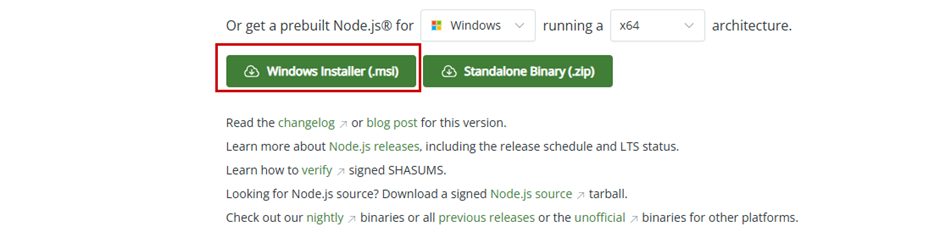
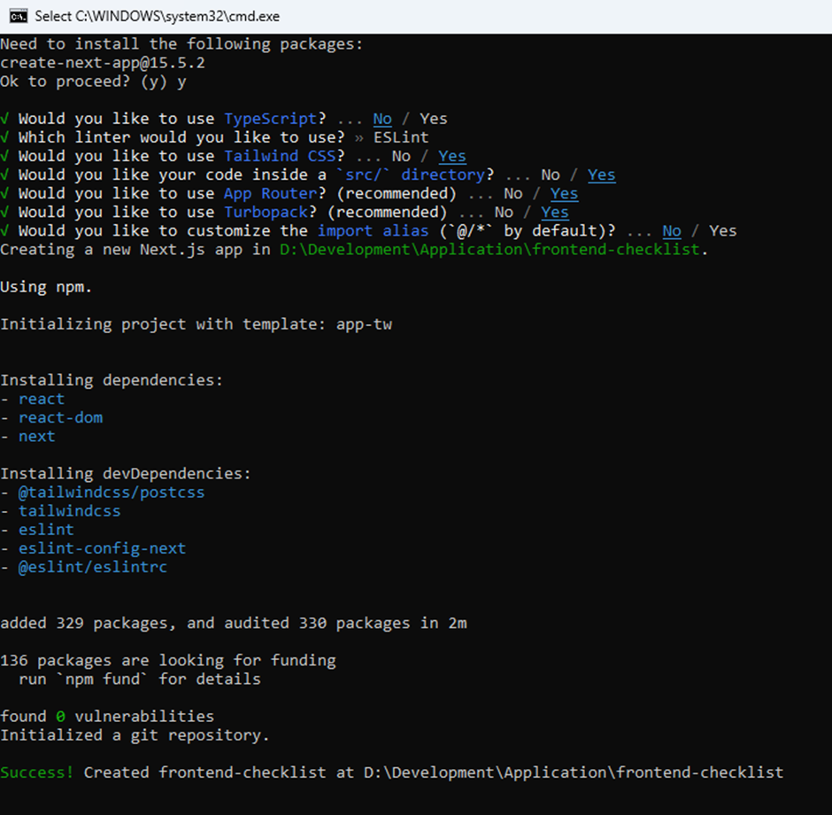
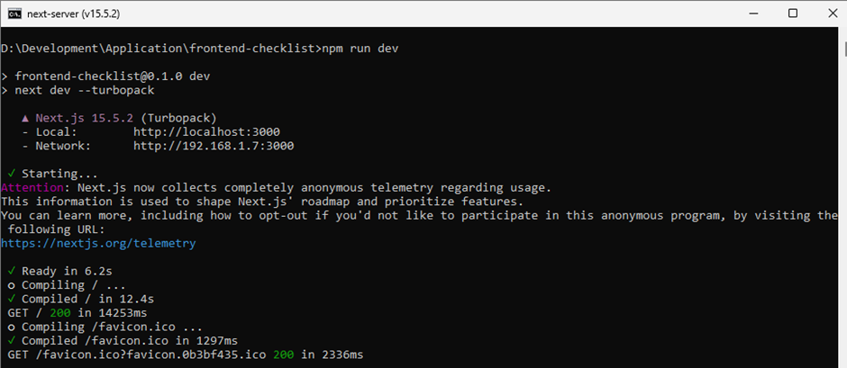
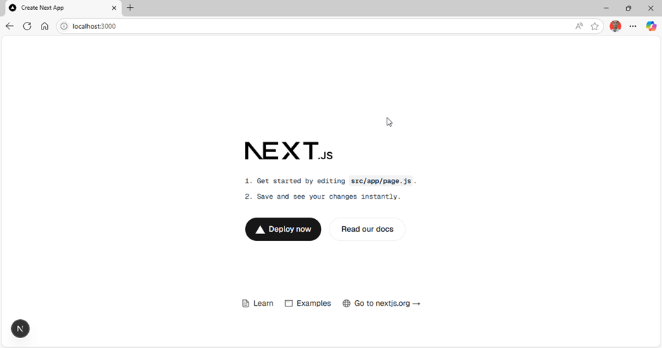
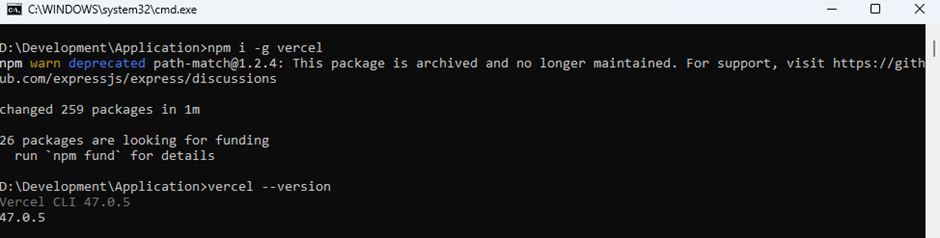
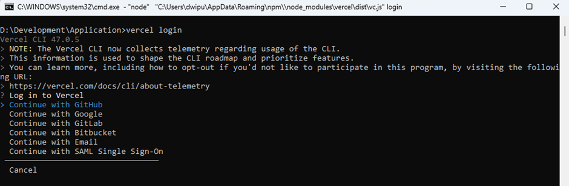

# Setup Project
## Download Node Js
[https://nodejs.org/en/download](https://nodejs.org/en/download)





## Version Node Js
```dockerignore
node v22.19.0
npm 10.9.3
```

## Create Project
`npx create-next-app frontend-checklist`<br>



## Run Project
```bash
npm run dev
```




## Vercel 
```bash
npm i -g vercel
```



