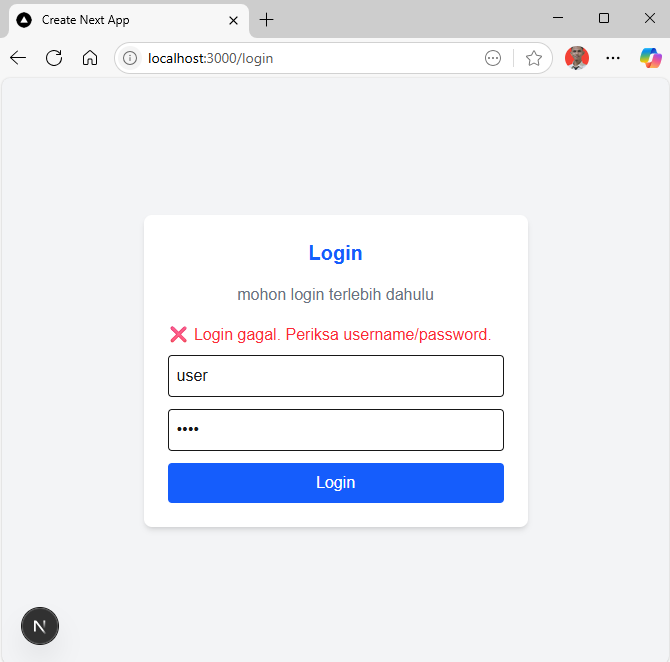

# Checklist System for Manufacture 
This is a simple [Next.js](https://nextjs.org) project for a frontend and using [Go](https://go.dev/dl/) for a backend and deployment using vercel

## Getting Started
### Installation Project [Here](/Install.md)
First, run the development server:

```bash
npm run dev
```

Open [http://localhost:3000](http://localhost:3000) with your browser to see the result.

## Flow Proses
### Login
```dockerignore
User input username & password → Backend memvalidasi dan mengembalikan token JWT → Token disimpan di localStorage
```
### Checklist
Hanya bisa diakses jika token valid <br>
* Read Checklist
```
Fetch checklist dari backend menggunakan token
```
* Add checklist:
```dockerignore

Pilih kategori → Pilih task dari daftar saran → Submit → backend menyimpan data
```
* Update checklist:
```dockerignore
Klik tombol “Mark as Done / Mark as Pending” → Backend update status
```

* Delete checklist:
```dockerignore
Klik tombol Hapus → backend hapus data
```

### Logout
```dockerignore
Menghapus token dari localStorage → Redirect ke halaman login
```

## Front-end
* Manage Checklist `CRUD` `Login Required`
* Login `Authentication`
* Structure
```dockerignore
/frontend-checklist
  /app
    page.js
    login/page.js
    checklist/page.js
  package.json
```
## Back-end
* Function Login Authentication `jwt token`
* Function Checklist `Create` `Read` `Update` `Delete`
* Temporary Database
* Structure
```dockerignore
/backend-checklist
  main.go
  go.mod
  auth.go
  checklist.go
  vercel.json
```
* API
```dockerignore
http://localhost:9090

Endpoints:

POST /login → login user

GET /checklist → ambil semua checklist

POST /checklist → tambah checklist

PUT /checklist → update status checklist

DELETE /checklist?id=... → hapus checklist
```

### Tools
* Frontend: `Next.js`, `React`, `TailwindCSS`
* Backend: `Golang`, `net/http`, `API`
* Deployment: `Vercel`
* Authentication: `JWT Token`
* Database : `Temporary Database`, `Local Storage`

## Screenshoot


Account : `admin` `password123` <br>


